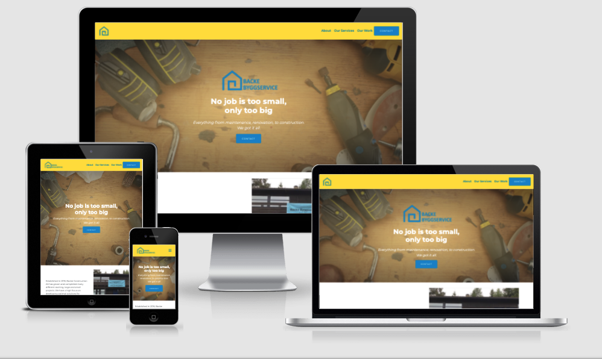
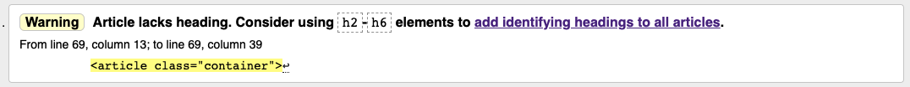
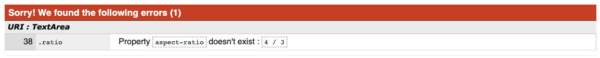
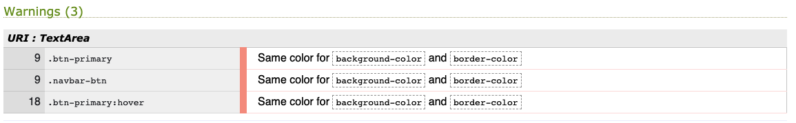
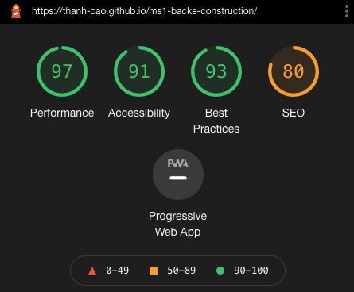

# Backe Construction AS Website

## Introduction
This is milestone project 1: User centric front-end development, for Code Institute’s Full-stack development program.

The idea of the project is to build a static front-end site for Backe Construction AS (or Backe Byggservice AS in Norwegian), a small Norwegian company offering construction services in Oslo and Viken regions. The company doesn't have any online presence for now except for a pin on Google Maps. They want to create a better credibility for the company and more online presence in order to attract new customers.

## Showcase

[Link to the live project here](https://thanh-cao.github.io/ms1-backe-construction)

## User Experience (UX)
### User Stories
1. As a first time visitor, I want to understand what the website is about and the purpose of it.
2. As a first time visitor, I want to easily navigate through the website to find out the information I need.
3. As a first time visitor, I want to learn more about what kind of services the company offers.
4. As a first time visitor, I want to see previous work they have done, so that I can estimate their competencies.
5. As a first time visitor, I want to quickly send a message, so that I can ask further questions or to get a quote from the company.
6. As a returning visitor, I want to quickly find contact information of the company.

### Strategy
The company's goal of the website is to present the company and attract customers.
The external user’s goal is to know more about what kind of services the company offers and the work they have done as well as how to contact them.

### Scope
In order to narrow down what the website should be included, a list of requirements for both content and functionality was identified.

1. Content requirements:
* Company's motto
* Who they are and the area they primarily serve
* The services the company offers
* Previous work
* Contact information
2. Functionality requirements:
* Easy navigation to find the information that the user needs
* Image gallery to showcase previous work and improve company's credibility
* Contact form which allows users to quickly send inquiries or ask for quotes

### Structure
The layout of the page is structured as a single page application for simplicity and flow. A user can scroll down in order to explore content of the page or use the navigation menu which is fixed on top to jump around the content. The menu will also have indicators as users scroll down to inform them where they are on the page.

The site includes a header for navigation bar and footer which has company's contact information and links. The main content is divided into 4 sections: about us, our services, our work, and contact form.

### Skeleton
#### Design
* Color scheme:
  * The website’s color scheme is based on the company’s current business card with primary color is blue (hex #0089D0) same as the logo and secondary color is yellow (hex #FFE161).
* Typography:
  * The main font being used throughout the website is Montserrat and the fallback font is Sans Serif in case of failure loading the main font.
* Imagery:
  * The company provides a folder of all images they have. Due to low quality and resolution, those images can only be used for showcasing their work. For other visual elements, stock images are chosen.

#### Wireframes
Wireframes for mobile, tablet, and desktop were created using Figma - [View](https://www.figma.com/file/RO34b9AdfwEk65d08dkByw/MS1-Backe-Construction).

#### Design changes
1. *Our work section:* in the wireframe, the work gallery in large screen was supposed to be a 3-column grid. However, after cosolidating all the photos provided by the company, I decided to go with 4 columns in order to better present 8 different works.

2. *Contact Us section:* in the wireframe, it was supposed to be only contact form accross different screens. However during development, I found that on larger screen, it looks a little boring so I decided to add company's contact info on the right side to create more balance to the section.

## Features
### Existing Features
#### Navigation bar
A responsive navigation bar is created using Bootstrap framework. The navigation bar collapses for small and medium devices (at breakpoint 768px) and utilizes hamburger menu icon for intuitive experience. I also implemented scroll spy feature from Bootstrap in order to give users indicator where they are on the page as the scroll down. The company's logo is featured on the left side and links to main page which takes a user to the top of the page.

#### Footer
Footer includes company's contact information and logo. The website's menu links are also included to allow user easily go back to previous sections when they have reached the end of the page.

#### About Us
* A jumbotron is used to create call-out section that features company's motto and a Contact button that links to the "Contact Us" section on the page. Hero image is taken from Unplash showing some common building tools on wooden table in order to establish the theme and feel of the site. The same hero image in portrait orientation is used to portrait phones less than 576px. The company's logo is only shown on large devices. It is hidden on smaller devices and the full logo is shown on navigation bar instead in order to save screen property.
* A brief introduction of the company and an image showcasing a residential house project built by the company followed by information on the main regions the company serves. 

#### Our Services
The four core services the company offers with descriptions. Stock images from Unsplash are used as background to better illustrate the services. An overlay is used in order to make the texts easier to read.

#### Our Work
This section showcases the company's 8 different projects by using gallery grid that is responsive to different screen sizes. Some project/work has carousel feature which allows users to scroll by themselves in order to see before/after or to see different projects in the same type of work.

#### Contact Us
Contact form allows user to send a message to the site's owner. A popup message appears after users submit the form to let them know that they have successfully sent the message. Due to the scope of this milestone project, the form cannot send any data yet. This is left for future implementation.

### Features for furture implementation
* Contact form to be able to deliver message to the site's owner.
* Testimonials/references in order to further increase credibility and trust.
* Seperate pages for Our Services and Our Work sections in the future if the company decides to add more.

## Technologies Used
### Languages
* [HTML5](https://developer.mozilla.org/en-US/docs/Web/Guide/HTML/HTML5) - create structure and content of the website.
* [CSS3](https://developer.mozilla.org/en-US/docs/Web/CSS) - add custom styling and override Bootstrap stylings to fit with the theme of the website.
* [Javascript](https://www.javascript.com/) - mainly taken from Bootstrap framework to create navigation bar, carousel, and popup modal.

### Frameworks, Libraries & Programs
* [Bootstrap](https://getbootstrap.com/) - the main framework being used in order to quickly set up responsive layout of the website.
* [Figma](https://www.figma.com/) - for the purpose of creating wireframes.
* [Adobe Illustrator](https://www.adobe.com/no/products/illustrator.html) - recreate company's logo and stimulate color scheme.
* [Visual Studio Code](https://code.visualstudio.com/) - the main code editor being used for this project.
* [Chrome DevTools](https://developer.chrome.com/docs/devtools/) - and its integrated Lighthouse tool were used for debugging during development testing process.
* [Git](https://git-scm.com/) - the built-in Git feature in VS Code was used for version control and push to github.
* [Github](https://github.com/) - Github is used to store project's code remotely. 
* [Google Fonts](https://fonts.google.com/) - to import Montserrat font which is the main font being used on this project.
* [Font Awesome](https://fontawesome.com/) - implement icons for contact information and collasped navigation menu.
* [CSS Gradient](https://cssgradient.io/) - create gradient overlay for the hero image.
* [Pic Resize](https://picresize.com/) - to resize large images to improve speed in loading webite.

## Testing
### During development
During development, Chrome DevTools was used intensively for debugging and adjusting codes on multiple devices. On top of that, the website was viewed on different browsers (Google Chrome, Firefox, Safari, Internet Explorer) and physical devices (13-inch desktop screen, 27-inch screen, iPhone X, Samsung Galaxy S9 and S21+, iPad) to see if things work properly. Thanks to this practice I found out a small overflow issue which I hadn't caught using DevTool.

### Validators and tools
#### W3C validators
In order to make sure there were no syntax errors found in the project, [W3C Markup Validator](https://validator.w3.org/nu/) and [W3C CSS Validator](https://jigsaw.w3.org/css-validator/) services were utilized to validate the page:
* When validate the project's markup, the result came out with a warning (as seen in image below) on my use of `<article>` tag without any headings at the "Our Work" section for the image gallery. After reading more about the semantic use of `<article>` tag, I then changed all these tags to `
` since this is more appropirate.
  

* Validating my CSS custom codes through W3C validator came out with 1 error. When working with the gallery at the Our Work section, there are a few images that don't match with the desired aspect ratio. So I used a CSS property `aspect-ratio`, something I had come across a while ago from an article, to adjust those images. However, that property came out as not existing through the Jigsaw validator and I learned from [MDN Web Docs](https://developer.mozilla.org/en-US/docs/Web/CSS/aspect-ratio) that the property is a new thing and isn't compatible with all the browsers. Then I found and adapted a solution to fix this from [a pqina's blog post](https://pqina.nl/blog/presenting-images-in-an-aspect-ratio-with-css/).
  

* W3C CSS validation also came out with a warning that the button has the same background and border color. I decided not to act on this warning as I would like to keep the 2 properties for future changes in case there are changes in the company's color scheme.
  

#### Lighthouse evaluation
I also used Chrome DevTools' Lighthouse to evaluate the overall performance of the website several times during development. This tool gave me suggestions to compress image files, provide alt text to images, etc. After all the optimizations based on the suggestions, the website ends up with the results as in below:

### User Story Testing
1. As a first time visitor, I want to understand what the website is about and the purpose of it.
* When users enter the website, they will see right away the logo of the company "Backe Constructions AS" which gives a hint as to what this company does.
* The theme and purpose of the website is made clearly within the call out section. Hero image has tools on wooden table which gives out the theme of the site. The company's motto then gives more information what the company does and the ability to contact them if any questions. 

2. As a first time visitor, I want to easily navigate through the website to find out the information I need.
* The site is built as a simple page application with content clearly separated by headings and/or visuals.
* At the top of the page is a fixed intuitive navigation bar that informs users what information they can find and click to the desired section. Each link of the navigation has an indicator as users scroll down the site to let them know where they are.
* Navigation links appear again at the bottom of the page so that users can go back quickly to previous sections without feeling trapped at the end.

3. As a first time visitor, I want to learn more about what kind of services the company offers.
* The different services are clearly presented with a bold heading and a short text describing it. Furthermore, each service has its own background image relevant to the topic in order to reinforce the message.
* Since the company is capable of doing more than what they can summarize, there is a button in this section which allows users to contact the company for further information.

4. As a first time visitor, I want to see previous work they have done, so that I can estimate their competencies.
* The company's experience is displayed as a gallery with descriptions for the different types of work.
* Carousels are used in order to show before and after of some projects.

5. As a first time visitor, I want to quickly send a message, so that I can ask further questions or to get a quote from the company.
* Upon entering the site, users can see right away Contact button at the navigation bar that stands out from other links.
* Users are then directed to a simple contact which allows them to send their contact details as well as what it is they wonder about. 

6. As a returning visitor, I want to quickly find contact information of the company.
* The navigation bar has a visible contact button which quickly directs users to Contact Us section.
* Contact buttons are placed throughout the website so that returning users can easily find contact form and/or contact information.

### Further testing
A large amount of testing was done to ensure functionalities of the website.
* Navigation bar: all the links direct to its respective sections; indicators and scroll spy work as it should; navigation bar collapses at breakpoint and hamburger menu works properly.
* Contact form: form cannot be submit without filling out the required fields; validation for email field; after all inputs are filled and valid, a success message appears at submission.
* Responsive website: thorough reviewing the website on different devices using DevTool's to make everything works as it should be, also with landscape orientation on mobile.

### Known Bugs
* The work gallery has some carousels which include images that are in portrait mode, which breaks the layout of the section when users scroll to those images. 
* The carousel is set to be scrolled manually by users. However, when a user scrolls all the carousels a few times, they will continue to scroll automatically.

## Deployment
### Development
The project was created using VS Code and its integrated version control feature. Following [GitHub Docs](https://docs.github.com/en/github/authenticating-to-github/connecting-to-github-with-ssh) on how to create SSH key in order to authenticate and connect to GitHub without having to supply my username and password at each visit. With this setup, I am able to push git to GitHub remotely to store my codes.

### GitHub Pages
The project was deployed to GitHub Pages following these steps:
  1. Log in to GitHub and navigate to this project's respository: [ms1-backe-construction](https://github.com/thanh-cao/ms1-backe-construction)
  2. On the navigation bar of the repository, go to "Settings" tab
  3. Find on the left-hand side menu and locate "Pages"
  4. Under "Source", select Branch: main and click Save
  5. The page will refresh automatically and a link to the page is published on: [https://thanh-cao.github.io/ms1-backe-construction/](https://thanh-cao.github.io/ms1-backe-construction/)

### Cloning the project locally
Follow these steps to clone this project:
 1. Log in to GitHub and navigate to this project's respository: [ms1-backe-construction](https://github.com/thanh-cao/ms1-backe-construction)
 2. Under the navigation menu of the repository, locate and clock the button "Code" which shows different options to clone or download
 3. To clone this repository using HTTPS, copy the link under "Clone with HTTPS"
 4. Open Git terminal
 5. If needed, change the current workspace to the location where you want the repository to be cloned
 6. Type `git clone` and paste in the URL copied in step 3 and press Enter

## Credits
### Code
* Script to close collasped navigation bar after click came from this [StackOverflow thread](https://stackoverflow.com/questions/42401606/how-to-hide-collapsible-bootstrap-navbar-on-click)

* Script to open modal only after a form is submitted was adapted from this [StackOverflow thread](https://stackoverflow.com/questions/46054499/open-modal-bootstrap-on-submit-form)
  
### Content
The content was provided by the company Backe Byggservice AS in Norwegian as the target audience of the website is Norwegian. For the purpose of this milestone project, the texts were translated and adapted into English.

### Media
Photos being used to showcase company's previous work under "Our Work" section were provided by Backe Byggservice AS.
Other photos being used as background elements were obtained from [Unsplash](https://unsplash.com/).

### Acknowledgements
* Thanks to my mentor Narender Singh and the amazing Code Institute's Slack community for reviewing, giving feedback, mental support.
* Shout out to my peer Marina Pavlovic from Code Institute for helping me fix a bug on the Contact button under "Our Services" section which my tired eyes failed to catch after an overnighter.
